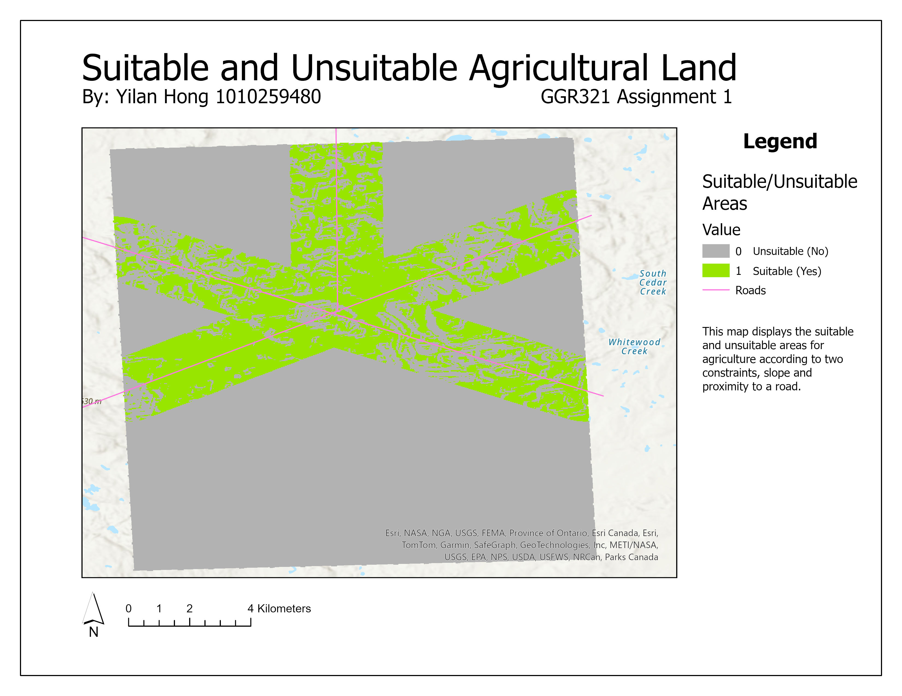
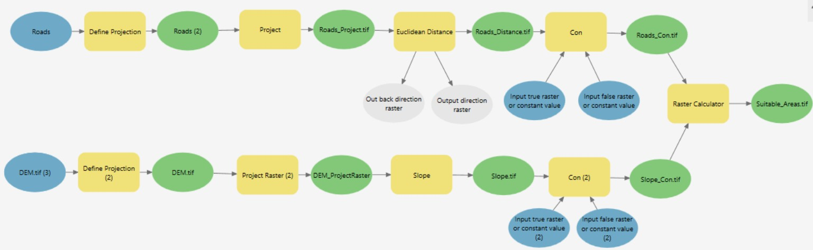
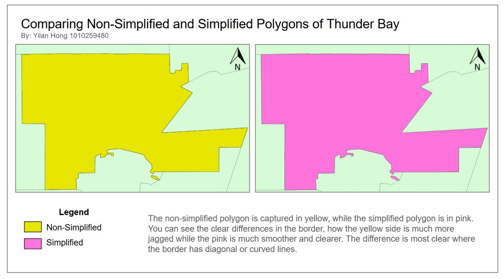

Below are the layouts nad models I made for this project, which was focused on using geoprocessing tools to determine the ideal areas of suitable agricultural land based on slope (derived from DEM) and distance to a road. The model builder tool was used to create a workflow to complete the geoprocessing requirements efficiently.

